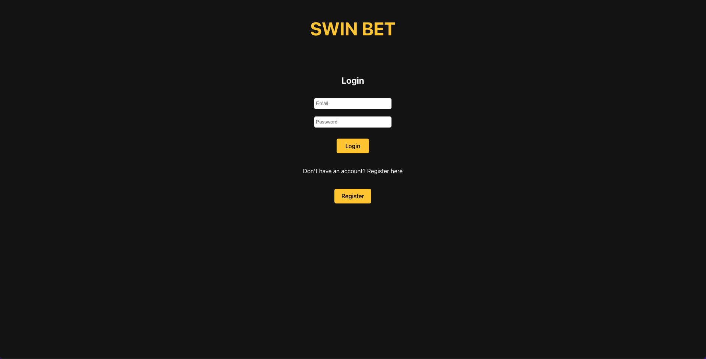
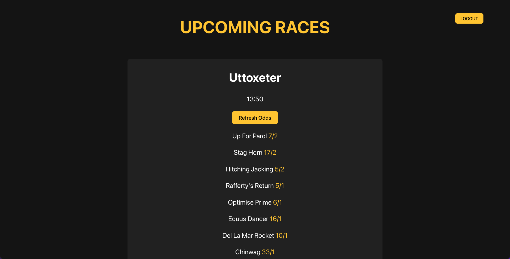
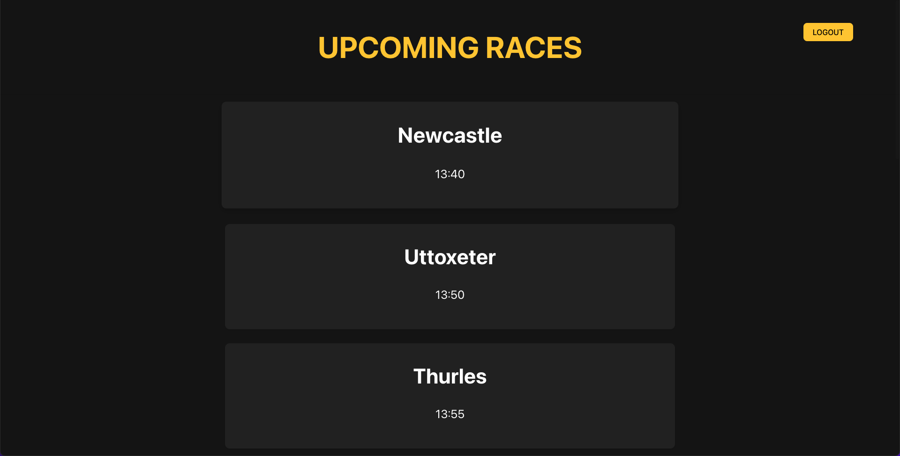

# Swin

Swin helps you collect data from a bookmaker and visualise horse racing events odds in a clear and concise way.

## Screenshots

<p align="center">
  
  
  
  
</p>

## Getting started

Swin is currently not deployed and requires setting up a mongoDB database to access full features. More info can be found in the readme of server folder. 


## Installation

1. Clone this repo and enter!

   ```bash
   git clone https://github.com/LukeNSaunders/Swin-Scraper.git
   cd breezy-app
   ```

2. cd into client/server folders and install dependencies.

   ```bash
   cd client 
   npm install
   
   cd server 
   npm install
   ```
  

3. Replace env credentials in the env.sample file provided. 
```bash 

# Your token key used to access JWT 
TOKEN_KEY=''

```

4. Start development server

```bash 
npm start 
```
5. Start front end app 
```bash 
npm run dev 
```


## Tech Stack

* [React](https://github.com/facebook/react) -  Front end library for building user interfaces. 
* [Express](https://github.com/auth0/nextjs-auth0) - Node.js Backend Framework. 
* [MongoDB](https://github.com/mongodb)(with Mongoose) - For proof of concept, a noSQL database was used initially. As the data stored becomes more complex, a transition to a relational database will be made.
* [Jest](https://github.com/facebook/jest) - Testing library. 

## Developers

* Luke Saunders - [GitHub](https://github.com/LukeNSaunders)
