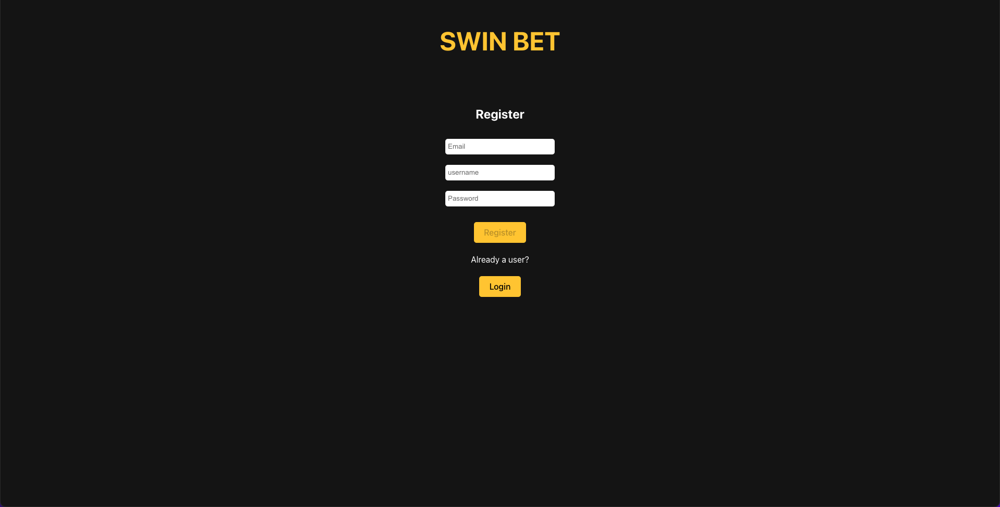

# Swin

Swin helps you collect data from a bookmaker and visualise horse racing events odds in a clear and concise way.

## Screenshots
<p align="center">
  <table>
    <tr>
      <td>
        
      </td>
      <td>
        
      </td>
    </tr>
    <tr>
      <td>
        
      </td>
      <td>
        
      </td>
    </tr>
  </table>
</p>

## Table of Contents

1. [Getting Started](#Getting-Started)
2. [Assumptions](#Assumptions)
3. [Tech Stack](#Tech-Stack)
4. [Developers](#Developers)

## Getting Started 

Swin is currently not deployed and requires setting up either a [MongoDB](https://gist.github.com/rupeshtiwari/2eaa1b40e5bdd23de27fef3289bc92f4) or [PostgreSQL](https://github.com/dwyl/learn-postgresql) database to access full features. More info about the API and testing endpoints can be found in the [Server](./server/README.md) README file. 

1. Clone this repo and enter!

```bash
git clone https://github.com/LukeNSaunders/Swin-Scraper.git
cd breezy-app
```

2. cd into client/server folders and install dependencies.

```bash
cd client
npm install

cd server
npm install
```

3. Replace env credentials in the env.sample file provided, for example.

```bash
Your token key used to access JWT
TOKEN_KEY=''
etc... 
```

4. Start development server

```bash
npm start
```

5. Start front end app

```bash
npm run dev
```

## Assumptions 

The following assumptions were made while developing this project:

1. The chosen bookmaker's website has a consistent structure for horse racing event pages, allowing for reliable web scraping.
2. The bookmaker's website does not have strict anti-bot measures in place that would block requests from Puppeteer.
3. The application will first employ the /events endpoint to fetch a collection of horse racing events, facilitating usage of valid event URLs directly from the bookmaker's website.
4. API users will provide a valid event URL when making requests to the /odds endpoint.
5. The project's scope is limited to the specific bookmaker chosen for this task and may not be applicable to other bookmakers without additional modifications.
6. The data fetched from the bookmaker's website, such as horse names and odds, will be consistently formatted and easily identifiable within the website's HTML structure.
7. The authentication and authorization process will be implemented using JSON Web Tokens (JWT) and stored in the browser's local storage to facilitate a seamless login and logout experience for users.
8. Users are required to register and log in to obtain a JWT token, which is necessary for accessing the protected /odds endpoint.
9. The client-side /dashboard route will be secured and accessible only to users who have successfully logged in.

## Tech Stack

- [React](https://github.com/facebook/react) - Front end library for building user interfaces.
- [Express.js](https://github.com/expressjs) - Node.js Backend Framework.
- [MongoDB](https://github.com/mongodb)(with Mongoose) - NoSQL database management system
- [PostgreSQL](https://github.com/postgres) - Open source relational database management system. 
- [Jest](https://github.com/facebook/jest) - Testing library.

## Developers

- Luke Saunders - [GitHub](https://github.com/LukeNSaunders)
