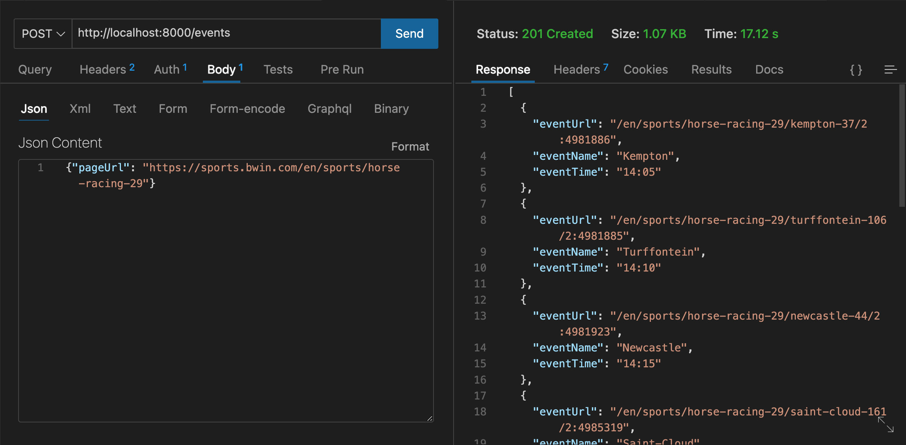
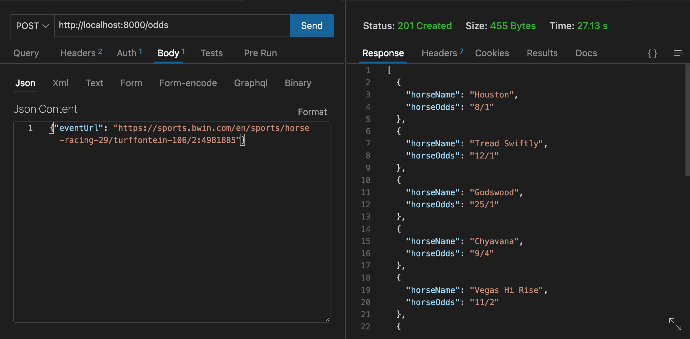

# SERVER

This project's backend provides two options for running the server with different databases. You can opt between MongoDB and SQL databases to run the application.

## Table of Contents

1. [Folder Structure](#folder-structure)
2. [Usage](#usage)
3. [API Endpoints](#api-endpoints)

## Folder Structure

The server project is organized into two subfolders:

- Mongo: Contains the setup and configuration for the MongoDB database.
- SQL: Contains the setup and configuration for the PostgreSQL database.

## Usage

To run the backend server with your desired database, navigate to either the Mongo or SQL folder and follow the instructions in the corresponding README file.

### MongoDB

Change to the [Mongo](./mongo) directory and follow the instructions in the `README.md` file.

### SQL

Change to the [SQL](./sequel) directory and follow the instructions in the `README.md` file.

By following the instructions in the chosen folder's README, you can set up and run the server with the database of your choice.

## API Endpoints

The following API endpoints are available:

### POST /odds:

Scrape odds for a given horse racing event from a bookmaker site.

Requires an Authorization header with the JWT token obtained from a successful login. In Thunder Client, set the token in the Auth section under the "Bearer" category.

**Example Request:**

```json

"Bearer Token": "Your_jwt_token_here"

{
"eventUrl": "https://sports.bwin.com/en/sports/horse-racing-29/hawthorne-246/2:4991436"
}

```

### POST /events

Scrape horce racing events for a given bookmaker site.

**Example Request:**

```json
{
  "pageUrl": "https://sports.bwin.com/en/sports/horse-racing-29/today"
}
```

### POST /register

Create new user in database.

**Example Request:**

```json
{
  "username": "exampleuser",
  "email": "example@example.com"
  "password": "examplepassword",
}
```

### POST /login

Query database and login user.

**Example Request:**

```json
{
  "email": "example@example.com",
  "password": "examplepassword"
}
```

<p align="center">
  
   
</p>
